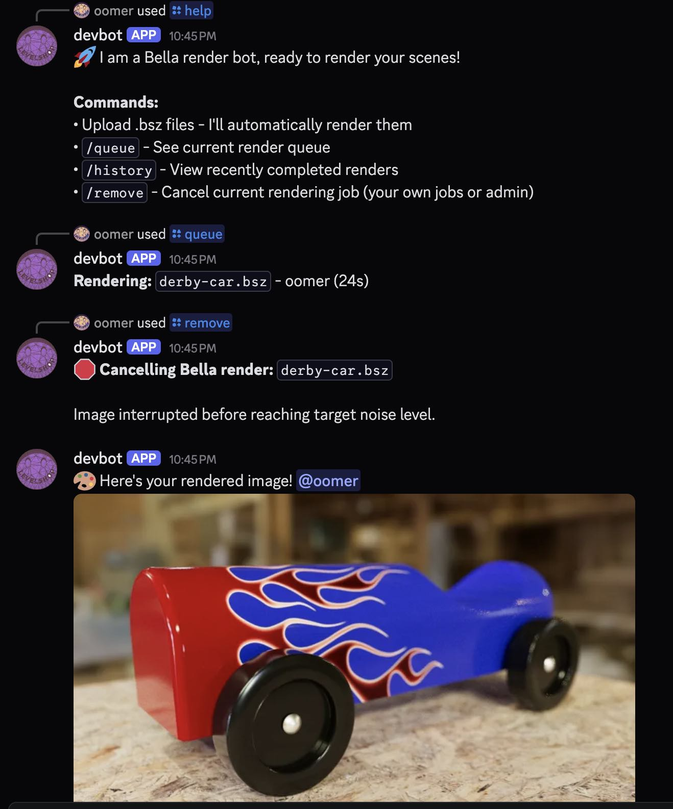

# poomer-discord-bella

### Overview

Prototype c++ Discord bot, that renders Bella scene files (.bsz)
- When one or more .bsz files are dropped into a channel, it will read the bsz, render and  send the jpeg back to the channel
- Will notify @{user}




#### Commands

- Upload .bsz files - I'll automatically render them
- `/queue` - See current render queue
- `/history` - View recently completed renders
- `/remove` - Cancel current rendering job (your own jobs or admin)
- `/resolution=100x800` - Override the scene resolution
- `/orbit=30` - Render camera orbit, returns .mp4 

----
### Technical details
- Uses DPP c++ lib for Discord comms
    - depends on openssl and zlib 
- non blocking multi-threaded, so it can listen for other users sending /help command 
- uses sqlite db to create a FIFO queue
- hardcodes outputDir and format to jpeg
- maintains scene resolution
- uses oom Bella utility lib
- uses ffmpeg to compile mp4

## Build

### Ubuntu 24.04 LTS

```
sudo apt update
sudo apt upgrade -y
sudo apt install build-essential curl git cmake zlib1g-dev libssl-dev ffmpeg -y
sudo apt install libsqlite3-dev -y
mkdir workdir
cd workdir
curl -LO https://downloads.bellarender.com/bella_engine_sdk-25.3.0-linux.tar.gz
tar -xvf  bella_engine_sdk-25.3.0-linux.tar.gz
git clone https://github.com/brainboxdotcc/DPP.git
cd DPP
cmake -B ./build
cmake --build ./build -j8
cd ..
git clone https://github.com/oomer/oom.git
git clone https://github.com/oomer/poomer-discord-bella.git
cd poomer-discord-bella
make all -j4
```

### MacOS

Install Cmake to /Applications
```
curl -LO https://github.com/Kitware/CMake/releases/download/v3.31.6/cmake-3.31.6-macos-universal.dmg
open cmake-3.31.6-macos-universal.dmg
```


```
mkdir workdir
cd workdir
curl -LO https://downloads.bellarender.com/bella_engine_sdk-25.3.0-macos.zip
unzip bella_engine_sdk-25.3.0-macos.zip
mkdir homebrew
curl -L https://github.com/Homebrew/brew/tarball/master | tar xz --strip-components 1 -C homebrew
eval "$(homebrew/bin/brew shellenv)"
brew update --force --quiet
brew install openssl
git clone https://github.com/brainboxdotcc/DPP.git
cd DPP
/Applications/CMake.app/Contents/bin/cmake -B ./build \
  -DCMAKE_OSX_ARCHITECTURES="arm64;x86_64" \
  -DCMAKE_OSX_DEPLOYMENT_TARGET=11.0 \
  -DOPENSSL_ROOT_DIR=../homebrew/opt/openssl@3 \
  -DOPENSSL_INCLUDE_DIR=../homebrew/opt/openssl@3/include \
  -DOPENSSL_CRYPTO_LIBRARY=../homebrew/opt/openssl@3/lib/libcrypto.a \
  -DOPENSSL_SSL_LIBRARY=../homebrew/opt/openssl@3/lib/libssl.a
/Applications/CMake.app/Contents/bin/cmake --build ./build -j8
cd ..
git clone https://github.com/oomer/oom.git
git clone https://github.com/oomer/poomer-discord-bella.git
cd poomer-discord-bella
make all -j4
```

